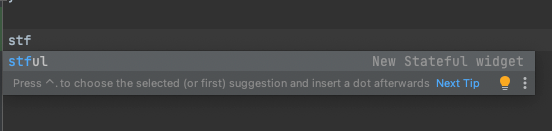

# Write your first Flutter app

https://docs.flutter.dev/get-started/codelab


# my_app

A new Flutter project.

## Getting Started

This project is a starting point for a Flutter application.

A few resources to get you started if this is your first Flutter project:

- [Lab: Write your first Flutter app](https://docs.flutter.dev/get-started/codelab)
- [Cookbook: Useful Flutter samples](https://docs.flutter.dev/cookbook)

For help getting started with Flutter development, view the
[online documentation](https://docs.flutter.dev/), which offers tutorials,
samples, guidance on mobile development, and a full API reference.





Scaffold is a blank white scrren in the material app :


If scaffold only includes the body, then the body will use the all area in the scaffold 


Appbar in the Scaffold:

```dart
appBar: AppBar(
          title: const Text('Startup Name Generator'),
          actions: [
            IconButton(
              onPressed: _pushSaved,
              icon: const Icon(Icons.list),
              tooltip: "Saved Suggestions",
            )
          ],
        ),
```


And also the _pushSaved function created inside the sate class:

```dart
class _RandomWordsState extends State<RandomWords> {
  //Add a _suggestions list for saving suggested word pairings.
  final _suggestions = <WordPair>[];
  final _saved = <WordPair>{};

  // Also, add a _biggerFont variable for making the font size larger.
  final _biggerFont = const TextStyle(fontSize: 18);

  void _pushSaved() {}

  @override
  Widget build(BuildContext context) {}
```

<iframe width="100%" height="720" src="https://www.youtube.com/embed/rIaaH87z1-g" title="YouTube video player" frameborder="0" allow="accelerometer; autoplay; clipboard-write; encrypted-media; gyroscope; picture-in-picture" allowfullscreen></iframe>

```dart
MaterialPageRoute<void>(
        builder: (context) {
          final tiles = _saved.map(
              (pair){
                return ListTile(
                  title: Text(
                    pair.asPascalCase,
                    style: _biggerFont,
                  ),
                );
              },
          );
          final divided = tiles.isNotEmpty
          ? ListTile.divideTiles(
            context: context,
            tiles: tiles
          ).toList()
              : <Widget>[];

          return Scaffold(
            appBar: AppBar(
              title: const Text('Saved suggestions'),
            ),
            body: ListView(
              children: divided,
            ),
          );
        }
      )
```


